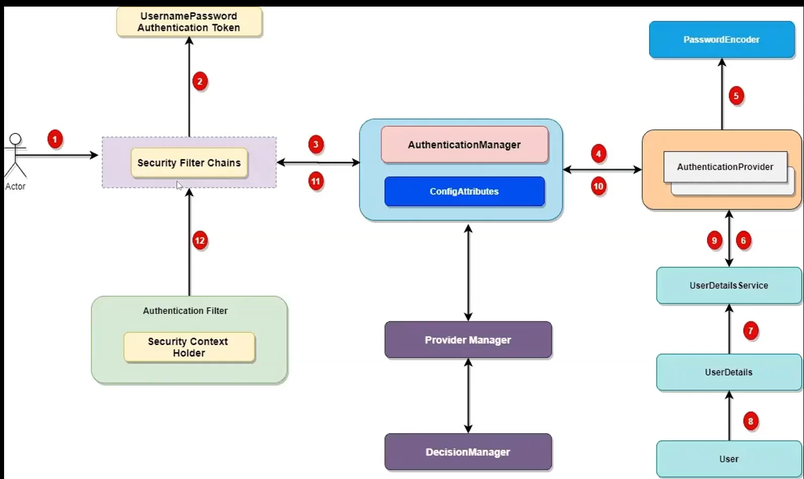
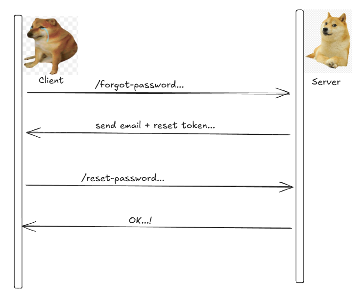

## 1 vài điểm cần lưu ý
- Tầng service chỉ nên gọi tầng repository của chính nó và cùng domain, không nên gọi tầng repository của domain khác.
- password không nên được lưu trữ trong database, thay vào đó nên sử dụng hash để mã hóa password.

## Các chức năng của auth-service
- Trả về danh sách người dùng
- Đăng ký người dùng mới và Xác thực người dùng
- Thay đổi mật khẩu và quên mật khẩu
- Phân quyền người dùng

## mẫu data response

```json
{
  "status": 200,
  "message": "user created successfully",
  "data": {
    "id": 123,
    "username": "john_doe",
    "email": "admin@gmail.com"
  }
}
```

## kiến trúc của spring security


## Các API của auth-service
### 1. Đăng ký người dùng mới ☑️
**POST** `/api/auth/register`

### 2. Xác thực người dùng ☑️
**POST** `/api/auth/login`

### 3. Làm mới token
**POST** `/api/auth/refresh-token` ☑️

### 4. Thay đổi mật khẩu
**POST** `/api/auth/change-password` ☑️

### 5. Quên mật khẩu
**POST** `/api/auth/forgot-password` -> gửi email chứa link reset password  
**POST** `/api/auth/reset-password` -> reset password

### 6. Trả về danh sách người dùng

**POST** `/api/v1/users/list` ☑️
#### Request body
```json
{
  "filters": [
    {
      "field": "username",
      "operator": "eq",
      "value": "123"
    },
    {
      "field": "age",
      "operator": "between",
      "value": [18, 65]
    },
    {
      "field": "status",
      "operator": "in",
      "value": ["ACTIVE", "PENDING"]
    }
  ],
  "sort": "id:DESC",
  "search": "ad",
  "page": 1,
  "size": 10
}
```
#### Response body

```json
{
  "status": 200,
  "message": "success",
  "data": {
    "items": [
      {
        "id": 1,
        "username": "john_doe",
        "email": "123@gmail.com",
        "status": "ACTIVE",
        "createdAt": "2023-01-01T00:00:00Z",
        "updatedAt": "2023-01-01T00:00:00Z"
      }
    ],
    "currentPage": 1,
    "totalElements": 100,
    "totalPages": 10
  }
}
```
### 7. Khôi phục password
<p align="center">
  
</p>

#### bước 1: Gửi email chứa link reset password
**POST** `/api/auth/forgot-password`
#### Request body
```json
{
  "email": "123@example.com"
}
```
#### bước 2: Reset password
**POST** `/api/auth/reset-password`
#### Request
body
```json
{
  "token": "reset_token",
  "newPassword": "new_password"
  "confirmPassword": "new_password"
}
```
