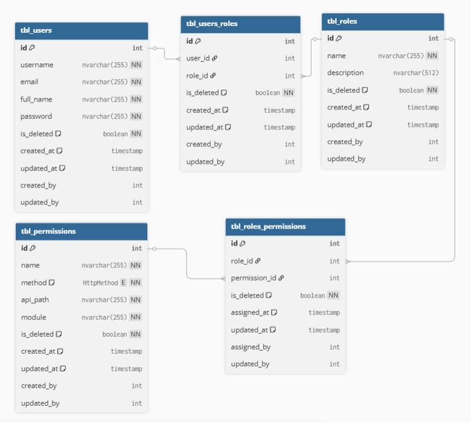

## 1 vài điểm cần lưu ý

### 1.1 Nguyên tắc chung

- Tầng service chỉ nên gọi tầng repository của chính nó và cùng domain, không nên gọi tầng repository của domain khác.

- password không nên được lưu trữ trong database, thay vào đó nên sử dụng hash để mã hóa password.
  
  ### 1.2 Tiêu chuẩn đặt tên cho Class / Entity

- **Quy tắc 1:** Tên các class/entity nên sử dụng PascalCase(UpperCamelCase).
  
  - Ví dụ: `UserEntity`, `UserRepository`, `UserService`.

- **Quy tắc 2:** Dùng danh từ SỐ ÍT (Singular): Điều này cực kỳ quan trọng. Một đối tượng (instance) của lớp Entity đại diện cho một thực thể, một hàng duy nhất trong bảng. 
  
  - ĐÚNG: `UserEntity`, `Order`, `Product`
  - SAI: `UsersEntity`, `Orders`, `Products`

### 1.2 Tiêu chuẩn đặt tên cho Table (Bảng trong Database)

- **Quy tắc 1**: Dùng snake_case cho các table.
  
  - Ví dụ: `roles_permissions`, `orders_items`, `products_categorys`.

- **Quy tắc 2**: Dùng danh từ SỐ NHIỀU (Plural)
  
  - ĐÚNG: `users`, `orders`, `products`
  - SAI: `user`, `order`, `product`

- **Quy tắc 3:** (Tùy chọn nhưng phổ biến): Thêm tiền tố (Prefix):
  
  - Ví dụ: tbl_users, auth_users

## Các chức năng của auth-service

- Quản lý người dùng
  
  - Tạo người dùng mới.
  - Cập nhật thông tin người dùng.
  - Xóa người dùng.
  - Lấy danh sách người dùng.

- Xác thực và phân quyền người dùng.
  
  - Thực hiện đăng ký người dùng mới(đang ký).
  - Xác thực người dùng (đăng nhập).
  - Làm mới token.
  - Thay đổi mật khẩu.
  - Xác thực email người dùng sau khi đăng ký.
  - Khôi phục mật khẩu người dùng.
  - Phân quyền người dùng dựa trên vai trò (role) và quyền (permission). (Phần phức tạp nhât)

## mẫu data response

```json
{
  "status": 200,
  "message": "user created successfully",
  "data": {
    "id": 123,
    "username": "john_doe",
    "email": "admin@gmail.com"
  }
}
```

## kiến trúc của spring security


## Các API của auth-service

### 1. Đăng ký người dùng mới ☑️

**POST** `/api/auth/register`

### 2. Xác thực người dùng ☑️

**POST** `/api/auth/login`

### 3. Làm mới token

**POST** `/api/auth/refresh-token` ☑️

### 4. Thay đổi mật khẩu

**POST** `/api/auth/change-password` ☑️

### 5. Verify email

**POST** `/api/auth/verify-email` -> xác thực email người dùng sau khi đăng ký

- Cập nhật lại api `/regiter` để gửi email xác thực sau khi đăng ký thành công.
- Ta sẽ gửi một email chứa link xác thực đến địa chỉ email của người dùng. Link này sẽ chứa một token duy nhất để xác thực.
- Sau khi người dùng nhấp vào link, hệ thống sẽ xác thực token và cập nhật trạng thái email của người dùng thành đã xác thực.

### 6. Trả về danh sách người dùng

**POST** `/api/v1/users/list` ☑️

#### Request body

```json
{
  "filters": [
    {
      "field": "username",
      "operator": "eq",
      "value": "123"
    },
    {
      "field": "age",
      "operator": "between",
      "value": [18, 65]
    },
    {
      "field": "status",
      "operator": "in",
      "value": ["ACTIVE", "PENDING"]
    }
  ],
  "sort": "id:DESC",
  "search": "ad",
  "page": 1,
  "size": 10
}
```

#### Response body

```json
{
  "status": 200,
  "message": "success",
  "data": {
    "items": [
      {
        "id": 1,
        "username": "john_doe",
        "email": "123@gmail.com",
        "status": "ACTIVE",
        "createdAt": "2023-01-01T00:00:00Z",
        "updatedAt": "2023-01-01T00:00:00Z"
      }
    ],
    "currentPage": 1,
    "totalElements": 100,
    "totalPages": 10
  }
}
```

### 7. Khôi phục password

<p align="center">
  
</p>

#### bước 1: Gửi email chứa link reset password

**POST** `/api/auth/forgot-password`

#### Request body

```json
{
  "email": "123@example.com"
}
```

#### bước 2: Reset password

**POST** `/api/auth/reset-password`

#### Request

body

```json
{
  "token": "reset_token",
  "newPassword": "new_password"
  "confirmPassword": "new_password"
}
```

## Final: Phân quyền (~~Ác mộng đôi mươi~~)

### 1. Phân quyền dựa trên URL (URL-Based Authorization)

- Đơn giản, phổ biến và dễ hiểu.

- Cách làm: Cấu hình trong `SecurityFilterChain` bean.
  
  ```java
  @Configuration
  public class SecurityConfig {
    @Bean
    public SecurityFilterChain securityFilterChain(HttpSecurity http) throws Exception {
        http.authorizeHttpRequests(auth -> auth
                // Ai cũng có thể gọi các API này
                .requestMatchers("/api/auth/**", "/public/**").permitAll()
  
                // Chỉ những người có quyền (authority) 'read:users' mới được gọi API GET user
                .requestMatchers(HttpMethod.GET, "/api/v1/users/list").hasAuthority("read:users")
  
                // Chỉ những người có vai trò (role) 'ADMIN' mới được gọi các API dưới /api/admin/
                .requestMatchers("/api/admin/**").hasRole("ADMIN")
  
                // Chỉ những người có vai trò 'ADMIN' hoặc 'TEACHER' mới được gọi API này
                .requestMatchers("/api/courses/create").hasAnyRole("ADMIN", "TEACHER")
  
                // Tất cả các request còn lại đều yêu cầu phải xác thực
                .anyRequest().authenticated()
        );
        // ... các cấu hình khác
        return http.build();
    }
  }
  ```

### 2. Phân quyền ở cấp độ Method (Method-Level Security)

- Mạnh mẽ hơn, linh hoạt hơn, có thể xử lý logic phức tạp hơn.
- Cách làm:
  - Bật tính năng này bằng cách thêm annotation `@EnableMethodSecurity` vào lớp `SecurityConfig`.
  - Sử dụng các annotation `@PreAuthorize`, `@PostAuthorize`, `@PreFilter`, `@PostFilter`.
    
```java
    // Trong một lớp Service nào đó

@Service

public class OrderService {

    // Đơn giản: Chỉ user có vai trò 'CUSTOMER' mới được tạo đơn hàng.
    @PreAuthorize("hasRole('CUSTOMER')")
    public Order createOrder(OrderData data) {
        // ... logic tạo đơn hàng
    }
    
    // Nâng cao: Chỉ user có username trùng với username trong tham số 'username'
    // hoặc user có vai trò 'ADMIN' mới được xem lịch sử đơn hàng.
    @PreAuthorize("#username == authentication.name or hasRole('ADMIN')")
    public List<Order> getOrdersForUser(String username) {
        // ... logic lấy đơn hàng
    }
}
```
### 3. Danh sách kiểm soát truy cập (Access Control Lists - ACL) - Thôi bỏ thằng này đi, ắc quy lắm

- Chi tiết và linh hoạt nhất, cho phép kiểm soát quyền truy cập dựa trên từng đối tượng cụ thể.
- Đồng thời phức tạp và khó quản lý nhất.
- Nếu muốn hình dung, nhìn vào GG docs:
  - Anh **A** cho chị **B** quyền `READ` & `WRITE` trên tài liệu của ảnh, ghét anh **C** nên chỉ cho `READ` và chỉ ngồi xem **A**&**B** thủ thỉ với nhau.
    
    #### **Kết luận**: Overkill, cho dự án của mình...

### 4. Kết hợp 1&2 ta sẽ có được RBAC (Role-Based Access Control)

- Tuyệt vời không có nhưng, 99% trên mạng đều chỉ các này.
- Lên mạng kiếm đi, không cần giải thích nữa.
  
  #### **Kết luận: ** đã nhưng chưa đủ...
- À mà ngoài ra thì còn có ABAC (Attribute-Based Access Control), kết hợp giữa `RBAC`+ `ACL`, cũng hay nhưng phức tạp hơn, không cần thiết cho dự án của mình.

### 5. Chưa biết tên gì, tạm gọi là `RBAC+`

- Ý tưởng: 
  - Giữ các table giữa nguyên `users`, `roles`' và chỉnh sửa 1 tý ở `permissions`.
  - Phần `permissions` sẽ lưu trữ thông tin về các `api` của mình: api_path, method...
- Cách làm:
  - Tạo 1 `custom filter` để lấy thông tin api từ request.
  - Lấy thông tin user từ `SecurityContext` -> lôi hết `permission` dựa vào `roles` của nó ra.
  - Hỏi anh Database:
    
    > Khứa user này có `permission` nào khớp với cái api mà nó đang gọi không fen...
  - **Có**: vô tiếp vòng trong...
  - **Không**: đi về nhà, với góc vườn nhiều chó nhiều gà...
    
    #### Thế khác biệt giữa `RBAC` và `RBAC+` là gì ?
- Với `RBAC` ta sẽ gán quyền qua anotation, vấn đề đặt ra là:
  - Nếu ta muốn thay đổi, thêm, xoá role của 1 api, ta phải mò nó nằm ở đâu để sửa code, build lại, deploy lại.
- Thế thì `RBAC+` khác choá gì.
- Khác chớ, để kể nghe:
  - Nếu muốn thêm, sửa, xoá 1 role nào đó, đơn giản là chỉ cần vào giao diện sửa thông qua các API mà ta đã xây dựng.
  - Không cần phải sửa code, build lại, deploy lại.
  - Vấn đề duy nhất của nó là performance, vì mỗi lần gọi api ta phải query database để kiểm tra quyền, nhưng với các hệ thống nhỏ thì không vấn đề gì.
  - Nếu sau này có lớn thì mình sẽ cache lại....
    
    #### Kết luận: Quá đã, thứ mà anh tìm kiếm bấy lâu nay...
    
    ## Bắt tay vào làm...
    
    <p align="center">
    
    </p>

### Những api sẽ có mặt trong cuộc chơi phân quyền này...

### 1. Nhóm quyền (Roles)

- **POST** `/api/v1/roles/list` - Lấy danh sách tất cả các roles.
- **POST** `/api/v1/roles` - Tạo mới một role.
- **PUT** `/api/v1/roles/{roleId}` - Cập nhật thông tin của một role.
- **DELETE** `/api/v1/roles/{roleId}` - Xoá một role.
- **DELETE** `/api/v1/roles/batch` - Xoá nhiều role cùng lúc.

### 2. Nhóm quản lý quyền (Permissions)

- **POST** `/api/v1/permissions/list` - Lấy danh sách tất cả các permissions.
- sẽ không có api tạo mới, vì permissions sẽ được lấy từ các api của mình.
- Dối với api có dạng `/api/v1/users/{userId}` ta sẽ chuyển nó về `/api/v1/users/*` 
- Sau đó sẽ dùng `AntPathMatcher` để so pattern

### 3. Nhóm người dùng (Users)

- **POST** `/api/v1/users` - Lấy danh sách tất cả người dùng. (cần cập nhật lại để nó lôi tất cả các role, permission của user ra)
- **POST** `/api/v1/users` - Tạo mới một người dùng. (khác với api `/api/auth/register`, nó sẽ không gửi email xác thực, mà sẽ tạo luôn user với quyền do admin chỉ định)
- **PUT** `/api/v1/users/{userId}` - Cập nhật thông tin của một người dùng.
- **DELETE** `/api/v1/users/{userId}` - Xoá một người dùng.
- **DELETE** `/api/v1/users/batch` - Xoá nhiều người dùng cùng lúc.
note: cần update lại api `/register` để nó gán 1 role mặc định cho user mới đăng ký, ví dụ: `default_user`