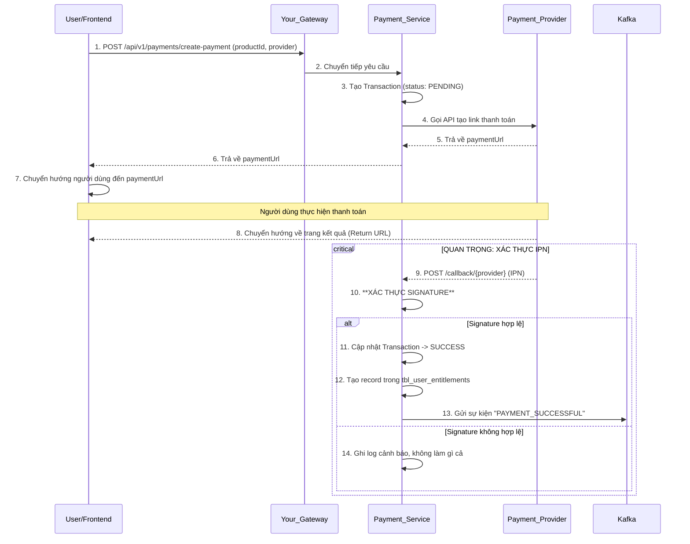

Chắc chắn rồi! Dựa trên schema DBML đã được cải tiến và hoàn thiện, tôi đã soạn thảo một tài liệu thiết kế kỹ thuật chi tiết cho `payment-service`.

Tài liệu này được cấu trúc theo định dạng `.md`, ưu tiên các API đơn giản trước và giải thích chi tiết các luồng phức tạp như bạn yêu cầu.

---

# Tài liệu Thiết kế Kỹ thuật: Payment Service

## 1. Tổng quan

### 1.1. Trách nhiệm

**Payment Service** là microservice chịu trách nhiệm cho toàn bộ vòng đời thương mại hóa sản phẩm trên nền tảng. Các trách nhiệm chính bao gồm:

*   **Quản lý Sản phẩm:** Cho phép tạo, cập nhật, và quản lý các sản phẩm có thể bán (khóa học, ebook, subscription, v.v.).
*   **Xử lý Giao dịch:** Tích hợp với các cổng thanh toán (VNPay, MoMo) để tạo và xác thực các giao dịch.
*   **Quản lý Quyền lợi (Entitlements):** Ghi nhận và quản lý quyền truy cập của người dùng vào các sản phẩm sau khi thanh toán thành công.
*   **Cung cấp API Nội bộ:** Cung cấp các endpoint an toàn cho các service khác (như `Course Service`, `Gateway`) để kiểm tra quyền truy cập của người dùng.

### 1.2. Nguyên tắc thiết kế

*   **Hướng sản phẩm (Product-Oriented):** Kiến trúc không gắn liền với "khóa học" mà là "sản phẩm", cho phép bán bất kỳ loại mặt hàng nào trong tương lai.
*   **Linh hoạt với Cổng thanh toán:** Sử dụng Strategy Pattern để dễ dàng thêm/bớt các nhà cung cấp thanh toán.
*   **Tách biệt Giao dịch và Quyền lợi:** Logic ghi nhận một lần thanh toán (`tbl_transactions`) được tách biệt hoàn toàn với logic về quyền lợi lâu dài của người dùng (`tbl_user_entitlements`).
*   **Khả năng Kiểm toán:** Tất cả các bước giao dịch và dữ liệu thô từ cổng thanh toán đều được lưu lại để đối soát và gỡ lỗi.

## 2. Sơ đồ Entity (Entity Schema)

Dưới đây là cấu trúc các bảng chính, đã được cải tiến để tối ưu và bảo mật.

```dbml
enum product_type {
  ONE_TIME
  SUBSCRIPTION
}

table tbl_products {
  id bigint [pk, increment]
  uuid varchar(36) [unique, not null]
  name varchar(255) [not null]
  thumbnail text [null]
  description text [null]
  price decimal(15, 2) [default: 0, not null]
  currency varchar(10) [default: 'VND', not null]
  product_type product_type [default: 'ONE_TIME', not null]
  is_active boolean [default: true, not null]
  organization_id bigint [not null]
  created_at timestamp [default: `now()`]
  updated_at timestamp [default: `now()`]
}

table tbl_payment_providers {
  id int [pk, increment]
  provider_name varchar(100) [unique, not null, note: 'VD: VNPAY, MOMO']
  display_name varchar(255) [null, note: 'VD: Thanh toán qua Ví MoMo']
  logo_url text [null]
  config_details jsonb [null, note: 'Lưu trữ cấu hình an toàn, không chứa secret key']
  is_active boolean [default: true, not null]
  created_at timestamp [default: `now()`]
  updated_at timestamp [default: `now()`]
}

enum product_item_type {
  COURSE
  EBOOK
  WEBINAR_TICKET
}

table tbl_product_items {
  id bigint [pk, increment]
  product_id bigint [ref: > tbl_products.id]
  item_uuid varchar(36) [not null, note: 'UUID của khóa học, ebook, ...']
  item_type product_item_type [not null, note: 'Loại mặt hàng là gì?']
  is_deleted boolean [default: false, not null]
  created_at timestamp [default: `now()`]
  updated_at timestamp [default: `now()`]
}

enum transaction_status {
  PENDING
  SUCCESS
  FAILED
  REFUNDED
}

table tbl_transactions {
  id bigint [pk, increment]
  order_code varchar(100) [unique, not null]
  user_id bigint [not null]
  product_id bigint [ref: > tbl_products.id]
  amount decimal(15, 2) [not null, note: 'Số tiền thực tế của giao dịch']
  status transaction_status [default: 'PENDING', not null]
  payment_provider_id int [ref: > tbl_payment_providers.id]
  gateway_transaction_id varchar(255) [null, note: 'Mã giao dịch do cổng thanh toán trả về']
  metadata jsonb [null, note: 'Lưu toàn bộ dữ liệu thô từ callback/IPN của cổng thanh toán']
  created_at timestamp [default: `now()`]
  updated_at timestamp [default: `now()`]
}

enum entitlement_status {
  ACTIVE
  EXPIRED
  REVOKED
}

table tbl_user_entitlements {
  id bigint [pk, increment]
  user_id bigint [not null]
  product_id bigint [ref: > tbl_products.id, note: 'Người dùng có quyền lợi với sản phẩm này']
  transaction_id bigint [ref: > tbl_transactions.id]
  start_date timestamp [default: `now()`]
  expiry_date timestamp [null, note: 'NULL nếu là vĩnh viễn']
  status entitlement_status [default: 'ACTIVE', not null]
}

```

## 3. Danh sách API (API Endpoints)

Các API được liệt kê theo thứ tự từ quản lý cơ bản đến các luồng nghiệp vụ phức tạp.

### 3.1. Quản lý Sản phẩm (Product Management)

Đây là các API cơ bản để admin của một tổ chức quản lý các sản phẩm họ bán.

#### 1. Tạo một Sản phẩm mới

*   **Endpoint:** `POST /api/v1/products`
*   **Mục đích:** Tạo ra một sản phẩm mới (ví dụ: một khóa học, một ebook) để có thể bán.
*   **Request Body (Mẫu):**
    ```json
    {
      "name": "Khóa học Lập trình Web Nâng cao với React và Node.js",
      "description": "Trở thành full-stack developer chuyên nghiệp sau 3 tháng.",
      "thumbnail": "uuid_cua_anh_bia.jpg",
      "price": 1200000,
      "currency": "VND",
      "product_type": "ONE_TIME",
      "is_active": true,
      "items": [
        {
          "item_uuid": "course-uuid-12345",
          "item_type": "COURSE"
        },
        {
          "item_uuid": "ebook-uuid-67890",
          "item_type": "EBOOK"
        }
      ]
    }
    ```
*   **Response Body (Thành công):**
    ```json
    {
      "status": 201,
      "message": "Tạo sản phẩm thành công.",
      "data": {
        "uuid": "prod-uuid-abcde",
        "name": "Khóa học Lập trình Web Nâng cao với React và Node.js",
        "price": 1200000,
        "product_type": "ONE_TIME",
        "is_active": true,
        "items": [
          { "item_uuid": "course-uuid-12345", "item_type": "COURSE" },
          { "item_uuid": "ebook-uuid-67890", "item_type": "EBOOK" }
        ],
        "created_at": "2025-08-31T10:00:00Z"
      }
    }
    ```

#### 2. Lấy danh sách Sản phẩm của một Tổ chức

*   **Endpoint:** `POST /api/v1/products/list`
*   **Mục đích:** Lấy danh sách sản phẩm thuộc về tổ chức của người dùng đang đăng nhập.
*   **Request Body (Mẫu):**
    ```json
    {
      "page": 1,
      "size": 10,
      "search": "React",
      "sort": "created_at:DESC"
    }
    ```
*   **Response Body (Thành công):** (Cấu trúc `PageResponseDto` quen thuộc)
    ```json
    {
      "status": 200,
      "message": "Lấy danh sách sản phẩm thành công.",
      "data": {
        "currentPage": 1,
        "totalElements": 1,
        "totalPages": 1,
        "items": [
          {
            "uuid": "prod-uuid-abcde",
            "name": "Khóa học Lập trình Web Nâng cao với React và Node.js",
            "price": 1200000,
            "product_type": "ONE_TIME",
            "is_active": true
          }
        ]
      }
    }
    ```

*(Các API `GET /products/{uuid}`, `PUT /products/{uuid}`, `DELETE /products/{uuid}` sẽ có cấu trúc tương tự.)*

### 3.2. Luồng Thanh toán Chính (Core Payment Flow)

Đây là luồng phức tạp và quan trọng nhất.

#### 1. Bắt đầu một Giao dịch Thanh toán

*   **Endpoint:** `POST /api/v1/payments/create-payment`
*   **Mục đích:** Người dùng chọn một sản phẩm và cổng thanh toán. API này sẽ tạo một giao dịch `PENDING` và trả về URL để chuyển hướng người dùng đến trang thanh toán.
*   **Request Body (Mẫu):**
    ```json
    {
      "product_uuid": "prod-uuid-abcde",
      "provider_name": "VNPAY",
      "redirect_url": "https://your-frontend.com/payment/result"
    }
    ```
*   **Response Body (Thành công):**
    ```json
    {
      "status": 200,
      "message": "Tạo yêu cầu thanh toán thành công. Vui lòng chuyển hướng.",
      "data": {
        "paymentUrl": "https://sandbox.vnpayment.vn/paymentv2/vpcpay.html?vnp_TmnCode=...",
        "orderCode": "LH_ORDER_1662552258"
      }
    }
    ```

#### 2. Endpoint nhận Callback/IPN từ Cổng thanh toán

*   **Endpoint:** `POST /api/v1/payments/callback/{provider}` (VD: `/api/v1/payments/callback/vnpay`)
*   **Mục đích:** **Endpoint cực kỳ quan trọng, chỉ dành cho máy chủ của cổng thanh toán gọi đến.** Nó xác nhận kết quả giao dịch một cách an toàn.
*   **Request Body (Mẫu):** (Dữ liệu do VNPay/MoMo tự động gửi đến, bạn không tạo ra nó)
    ```json
    // Đây là ví dụ, thực tế sẽ là dạng form-data hoặc query string
    {
      "vnp_Amount": "120000000",
      "vnp_TxnRef": "LH_ORDER_1662552258",
      "vnp_ResponseCode": "00",
      "vnp_SecureHash": "a1b2c3d4e5f6..."
    }
    ```
*   **Response Body (Thành công):** (Response trả về cho máy chủ của cổng thanh toán)
    ```json
    // Với VNPay
    {"RspCode":"00","Message":"Confirm Success"}
    ```

### 3.3. API Nội bộ và Kiểm tra Quyền (Internal & Access Check APIs)

Các API này không dành cho người dùng cuối mà cho các service khác trong hệ thống của bạn giao tiếp với nhau.

#### 1. Kiểm tra Quyền truy cập vào một Mặt hàng

*   **Endpoint:** `POST /api/internal/entitlements/check`
*   **Mục đích:** **API quan trọng nhất.** `Course Service` hoặc `Gateway` sẽ gọi API này để hỏi: "User này có quyền xem/dùng cái này không?".
*   **Request Body (Mẫu):**
    ```json
    {
      "user_id": 123,
      "item_uuid": "course-uuid-12345",
      "item_type": "COURSE"
    }
    ```
*   **Response Body (Thành công):**
    ```json
    {
      "status": 200,
      "message": "Kiểm tra quyền thành công.",
      "data": {
        "hasAccess": true,
        "expiry_date": "2026-08-31T10:00:00Z" 
      }
    }
    ```

## 4. Luồng Hoạt động Chi tiết

### 4.1. Luồng Thanh toán Hoàn chỉnh (VNPay/MoMo)

Luồng này bao gồm sự tương tác giữa nhiều bên: Người dùng (qua Frontend), Payment Service, và Cổng thanh toán.



### 4.2. Luồng Kiểm tra Quyền Truy cập vào Khóa học

Đây là luồng giải thích cho API `/api/internal/entitlements/check`.

1.  **Người dùng** cố gắng truy cập vào một khóa học có `course_uuid = 'course-abc-xyz'`.
2.  **Course Service** nhận được yêu cầu. Trước khi trả về nội dung, nó cần xác minh quyền truy cập.
3.  **Course Service** gọi đến **Payment Service** qua endpoint nội bộ: `POST /api/internal/entitlements/check` với body `{ "user_id": 123, "item_uuid": "course-abc-xyz", "item_type": "COURSE" }`.
4.  **Payment Service** thực hiện một câu truy vấn SQL duy nhất và hiệu quả:
    ```sql
    SELECT EXISTS (
        SELECT 1
        FROM tbl_user_entitlements e
        JOIN tbl_product_items pi ON e.product_id = pi.product_id
        WHERE
            e.user_id = 123 -- ID người dùng
            AND pi.item_uuid = 'course-abc-xyz' -- UUID của khóa học
            AND pi.item_type = 'COURSE' -- Loại mặt hàng
            AND e.status = 'ACTIVE' -- Quyền lợi còn hiệu lực
            AND (e.expiry_date IS NULL OR e.expiry_date > NOW()) -- Còn hạn sử dụng
    );
    ```
5.  Database sử dụng các `index` đã được tối ưu để thực thi câu lệnh này cực kỳ nhanh.
6.  **Payment Service** nhận kết quả (ví dụ: `true`) và trả về cho **Course Service**.
7.  **Course Service** thấy người dùng có quyền, liền trả về nội dung đầy đủ của khóa học. Nếu không, nó sẽ trả về lỗi `403 Forbidden`.