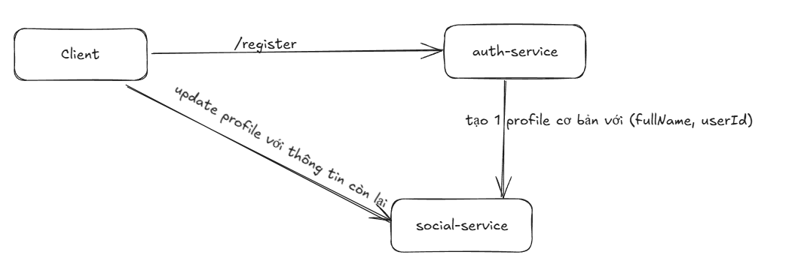

# Profile Service

## User Profile Service Entity
- Tên người dùng
- ảnh đại diện
- ngày sinh
- giới tính
- số điện thoại
- trường học
- social media links
- Các thông tin audit khác (ngày tạo, ngày cập nhật, người tạo, người cập nhật...)

## Các chức năng của profile service
- Quản lý thông tin cá nhân của người dùng
- Kết bạn với user khác
- Tạo và quản lý nhóm, bạn bè

### API Endpoints
### Tạo profile người dùng
#### Luồng hoạt động

#### Vấn đề phát sinh
1. Gửi request tạo profile từ Auth-Service -> Social-Service như thế nào?
- Ta sẽ dùng 1 message queue (`Kafka`) để gửi request từ `Auth-Service` -> `Social-Service`.
2. Nếu gửi message Kafka thành công, nhưng transaction của DB bị rollback thì sao?
- Giải pháp là ta sẽ đảm bảo message chỉ được gửi đi khi và chỉ khi transaction ghi vào cơ sở dữ liệu đã thành công (commit).
- sử dụng `TransactionalEventListener` để đảm bảo rằng sự kiện chỉ được phát hành sau khi giao dịch đã được cam kết thành công.

### Cập nhật profile người dùng
- `PATCH` `/api/v1/profile/me`  
- Cập nhật thông tin cá nhân của người dùng đã đăng nhập.
- Ta sẽ lấy thông tin userid từ jwt ra để cập nhật

